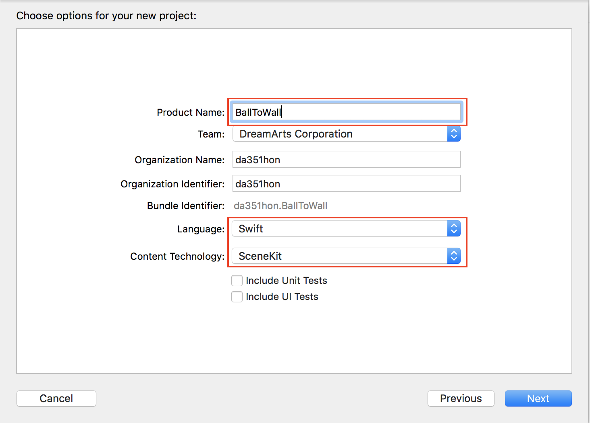

## BallToWall
### 概要
垂直面を認識し、タップした位置から物理演算を行って球を投げるデモ。
### 作成手順  

1. Xcodeで新規プロジェクトを作成し、「Augmented Reality App」を選択する。  
   

2. 任意のプロジェクト名（ここでは「BallToWall」とする）、Languageは「Swift」、Content Technologyは「SceneKit」を選択する。  
※ SceneKit：簡単に3Dゲームを作ることができるフレームワーク  
  

3. 飛行機を削除し、垂直面認識指定を行う処理を追加する。  
[変更内容](https://github.com/KantaiMishima/ARKit/commit/771027c1a18df5b7445072586dadd2a1ebd4a3ae)

4. 垂直面検出時に平面を配置、更新する処理を追加する。  
[変更内容](https://github.com/KantaiMishima/ARKit/commit/bbc6f32aef00a90aabfdc3ac51e2abe0ec94f7cd)

5. 実行すると以下のスクリーンショットのように表示される。垂直面を認識している場所に平面が配置される。  
  

6. タップした位置に球を配置する処理を追加する。  
[変更内容](https://github.com/KantaiMishima/ARKit/commit/70ae1611bf0efc5bb209a44390338a8367d7c5f9)

7. 球に対して物理演算処理を追加する。  
[変更内容](https://github.com/KantaiMishima/ARKit/commit/ddededb45ca2ada5b811b44c79380c43d117d85c)

8. 平面に対する物理演算を追加する。  
[変更内容](https://github.com/KantaiMishima/ARKit/commit/114b3604a812afbfdb6e043c83684348b3dfe763)

9. iPhoneを接続し、XCode上でビルドし、実行します。  
垂直面検出後に画面をタップすると、ボールが跳ね返る様子が確認できます。

### [今回のソースコード](https://raw.githubusercontent.com/KantaiMishima/ARKit/master/BallToWall/BallToWall/ViewController.swift)
