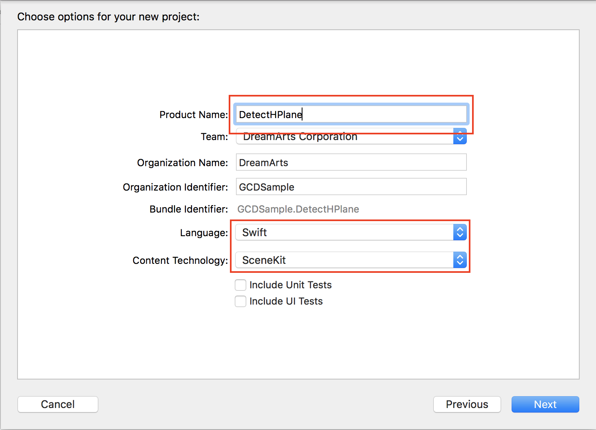
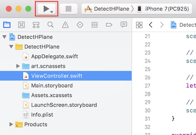
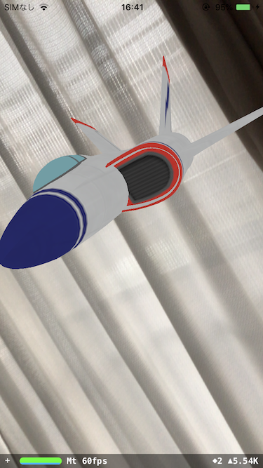
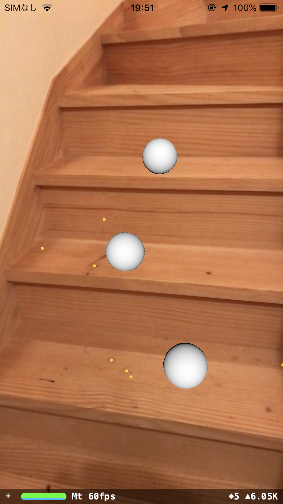

## DetectHPlane
### 概要
水平面を認識し、球を配置する。
### 作成手順  

1. Xcodeで新規プロジェクトを作成し、「Augmented Reality App」を選択。  
   

2. 以下の内容を入力。
SceneKit：簡単に3Dゲームを作ることができるフレームワーク  

|項目|入力内容|
| -- | -- |
|Project Name|任意のプロジェクト名(ここでは「DetectHPlane」)|
|Team|任意のアカウント(ここが「none」になっている人は教えてください)|
|Organization Name|任意のチーム名(ここでは「HIT」)|
|Organization Id|任意のチームID(ここでは「HIT」)|
|Language|Swift|
|Content Technology|SceneKit|

  

3. 一旦、実行してみる。iPhone/iPadを接続し、実行ボタンを押下。  
   ここで「信頼されていないデベロッパです」と怒られるので[こちら](https://code-schools.com/xcode-error-2/)を参考に対応
  
カメラスルーに飛行機が表示される。  
  

4. 飛行機を削除し、水平面認識指定を追加。  
[変更内容](https://github.com/da351hon/DetectHPlane/commit/2a964fc8b8b52a165174da7134336c1e415335cf)

5. 水平面検出時に球を配置する処理を追加。  
[変更内容](https://github.com/da351hon/DetectHPlane/commit/4280be1f1c8aea9408daf1aa038f70411c12b231)

6. 実行。
  

## [今回のソースコード](https://github.com/KantaiMishima/ARKit/blob/master/DetectHPlane/DetectHPlane/ViewController.swift)

## [次のセッションへ](../DetectImage)
