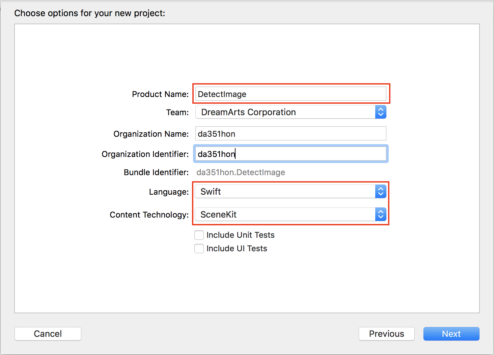
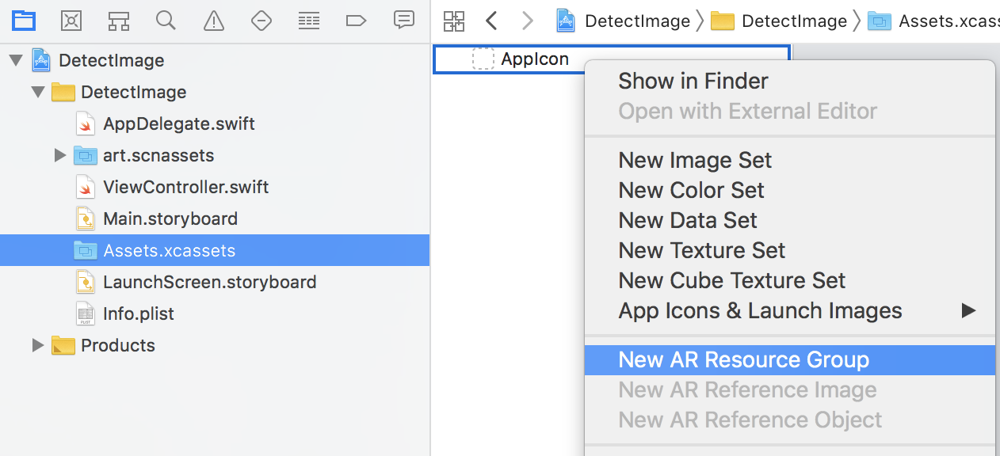
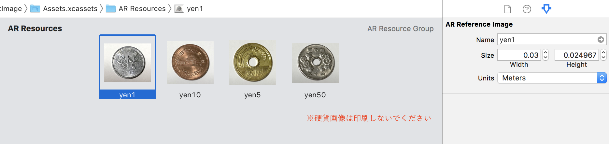
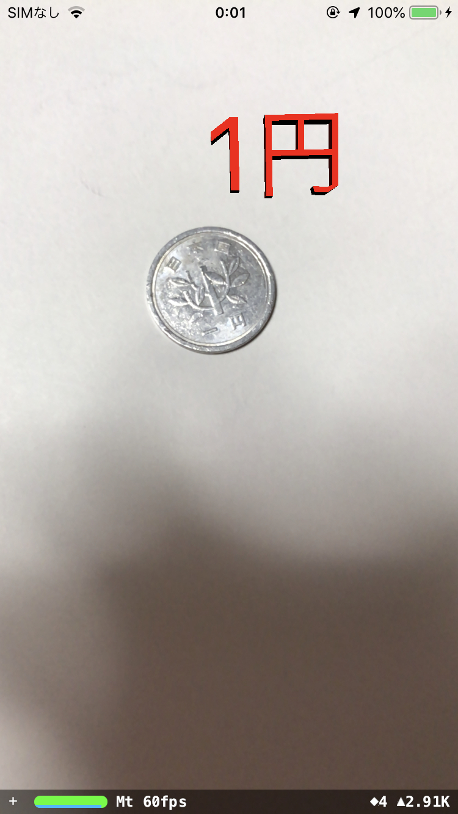

## [前のセッションへ](../DetectHPlane)

## DetectImage
### 概要
画像を認識し、3D文字を配置する。
### 作成手順  

1. Xcodeで新規プロジェクトを作成し、「Augmented Reality App」を選択。  
   

2. 任意のプロジェクト名(ここでは「DetectImage」)、Languageは「Swift」、Content Technologyは「SceneKit」を選択。  
SceneKit：簡単に3Dゲームを作ることができるフレームワーク  
  

3. 認識対象の画像を追加。  
Assets.xcassetsを選択し、右クリックから「New AR Resource Group」を実行。
   
画像をドラッグ＆ドロップで追加。 マーカーのサイズを指定。 
   

[今回はこちらの画像を使用してみましょう](https://user-images.githubusercontent.com/23329399/52778914-7058d200-308a-11e9-8947-64876a70f037.png)

4. 飛行機を削除し、画像認識指定を追加。  
[変更内容](https://github.com/KantaiMishima/ARKit/commit/518822df211222c2846de0c66a99ced85e8a8124)

5. 画像検出時に3D文字を配置する処理を追加。  
[変更内容](https://github.com/KantaiMishima/ARKit/commit/565363260d6a12616808afe659c2a243bffe3a3e)

6. 実行。  
   

### [今回のソースコード](https://raw.githubusercontent.com/KantaiMishima/ARKit/master/DetectImage/DetectImage/ViewController.swift)

## [indexへ戻る](../../../)
